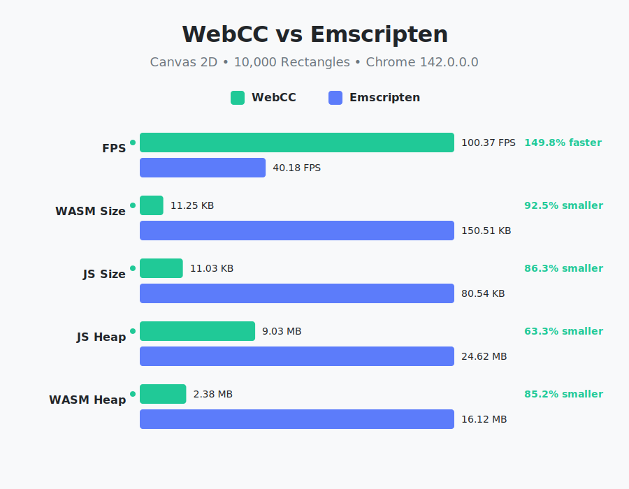

# WebCC vs Emscripten Benchmark

This directory contains a benchmark comparing **WebCC** against **Emscripten** for a Canvas 2D rendering task.

The benchmark renders **10,000 rectangles** per frame for 500 frames and measures:
- **FPS**: Average frames per second.
- **Binary Size**: Size of the generated `.wasm` and `.js` files.
- **Memory Usage**: JS Heap and WASM Heap usage.

## Prerequisites

- **Python 3**: For the runner script.
- **Emscripten (`emcc`)**: Required to build the Emscripten benchmark.
- **WebCC**: The project itself.

## Running the Benchmark

To build both projects and run the benchmark:

```bash
./run.sh
```

This script will:
1. Build the WebCC benchmark (`webcc/`).
2. Build the Emscripten benchmark (`emscripten/`).
3. Run `runner.py`, which starts a local server and opens both benchmarks in your default browser.
4. Collect results and generate a report.

If you have already built the projects and just want to run the benchmark:

```bash
python3 runner.py --no-build
```

## Results

The runner generates two files:
- `benchmark_results.json`: Raw data including file sizes and runtime metrics.
- `benchmark_results.svg`: A visual comparison chart.



## Structure

- `webcc/`: Source code for the WebCC implementation.
- `emscripten/`: Source code for the Emscripten implementation.
- `runner.py`: Python script that orchestrates the benchmark, collects data, and generates reports.
- `run.sh`: Bash script to build everything.
